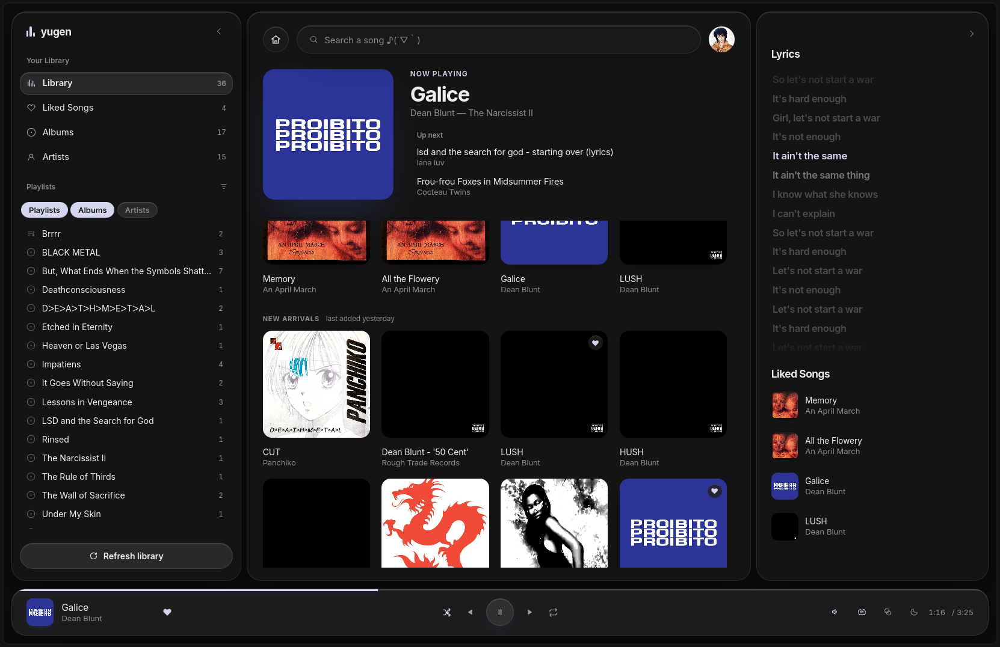
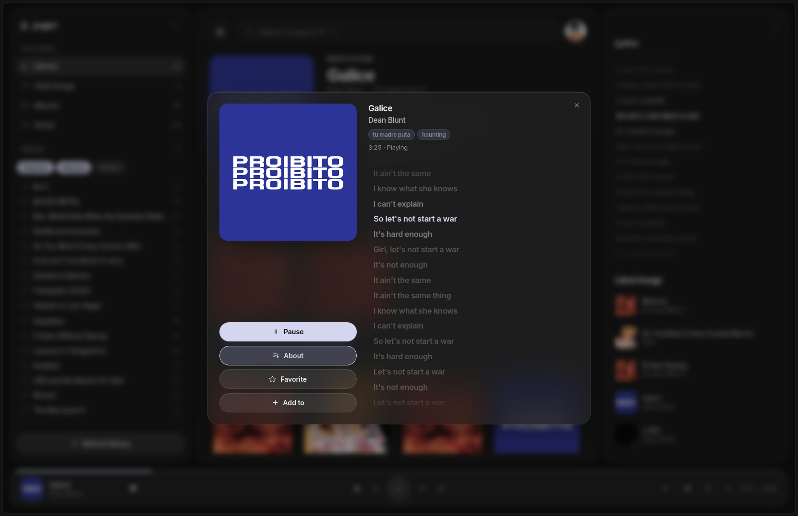
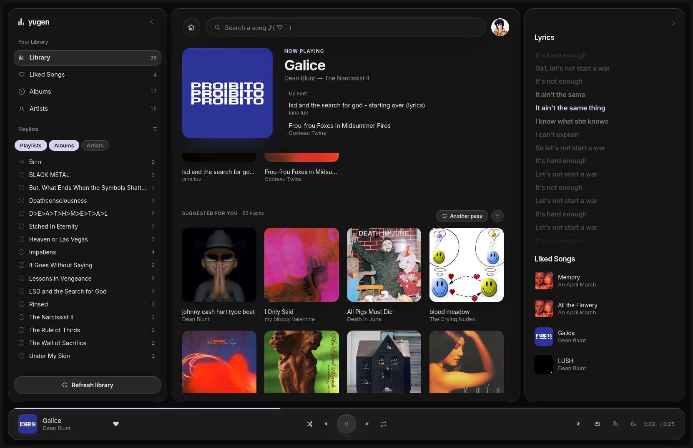
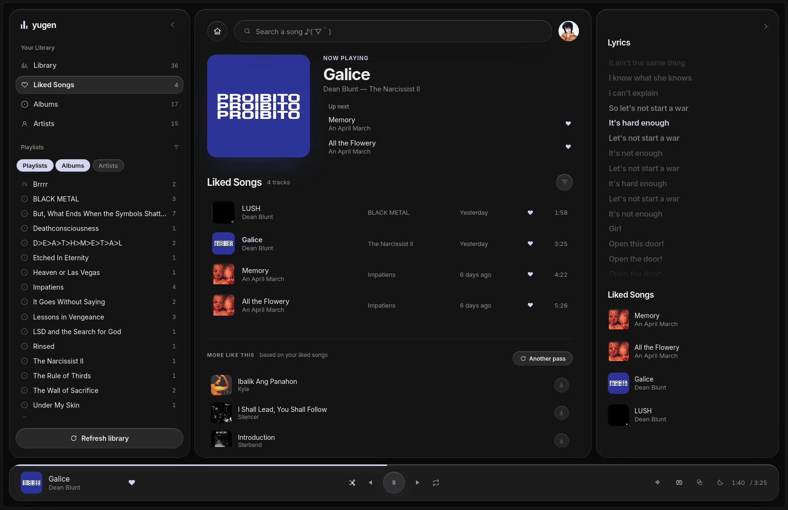

# yugen

<p align="center">
  
</p>

<p align="center">
  
  <br />
  <em>the track modal, with lyrics scrolling along</em>
</p>

<p align="center">
  
  
  <br />
  <em>what last.fm makes of the library, and of the songs you liked</em>
</p>

A desktop music player for Linux. Plays local mp3 files, searches and downloads
tracks from YouTube and SoundCloud through `yt-dlp`, keeps playlists and liked
songs, shows synced lyrics from [lrclib](https://lrclib.net), suggests what to
add next from [last.fm](https://www.last.fm), and tints itself with the cover
art of whatever is playing.

It publishes itself over MPRIS, so the track and the transport show up wherever
the desktop looks for a player — panels and shell dashboards, the lock screen,
`playerctl`, and the media keys.

The backend is C++ — [saucer](https://github.com/saucer/saucer) for the webview,
[miniaudio](https://miniaud.io) for playback, TagLib for metadata. The interface
is React + TypeScript, built into a bundle that is baked straight into the
executable, so the binary is all there is to run.

## Install

```sh
curl -sL https://raw.githubusercontent.com/gal1ce/yugen/master/install.sh | bash
```

It offers two options. `--appimage` and `--source` skip the prompt.

**AppImage** downloads the bundle into `~/.local/bin` and writes a launcher
entry. Nothing is installed system-wide and root is never asked for: WebKitGTK,
`yt-dlp` and `ffmpeg` all travel inside the bundle. The two things it cannot
carry are glibc, so the host has to be at least as new as the machine that built
the release, and the kernel's unprivileged user namespaces, which the bundled
WebKit needs to reach its own helper processes.

**From source** installs the toolchain and the dependencies for your distro,
puts `yt-dlp` on the nightly channel, builds, and installs into `/usr/local`.

### The last.fm key

The library page ends with a shelf of tracks you do not have yet, picked by
last.fm from what you have liked and favourited. That is the one thing here that
needs an api key — a free one from
[last.fm/api/account/create](https://www.last.fm/api/account/create). Everything
else works without it; skipping it only costs that shelf.

The installer asks for the key and writes it to `~/.config/yugen/lastfm_key`. If
`LASTFM_API_KEY` is already exported when you run it, that one is used and
nothing is asked:

```sh
export LASTFM_API_KEY="your-key"
curl -sL https://raw.githubusercontent.com/gal1ce/yugen/master/install.sh | bash
```

If you skipped it, or you built yugen yourself, there are two ways in. Write the
file directly:

```sh
mkdir -p ~/.config/yugen && echo "your-key" > ~/.config/yugen/lastfm_key
```

Or export the key once and start yugen from that same shell — it copies the key
into that file on startup, so it is a one-time thing rather than something to
put in your shell rc:

```sh
export LASTFM_API_KEY="your-key"
yugen
```

An `export` on its own is not enough, because it only lives in the shell that
ran it: yugen started from the desktop launcher, or from your next terminal,
would come up without a key. The file is what carries it across runs, and it is
read first thing at startup, so a key added while yugen is running takes effect
the next time it starts.

The AppImage can also be built locally with
[`packaging/appimage/build.sh`](packaging/appimage/build.sh). Build it inside an
old base image if you mean to hand it to anyone else — the glibc of the build
host is the floor for every machine that runs it.

## Building

Needs CMake 3.10+, a C++23 compiler, `pkg-config`, Node.js, the dev packages for
`taglib`, `libcurl` and `glib2` (for GDBus, which serves the MPRIS interface),
WebKitGTK, and `yt-dlp` + `ffmpeg` on `PATH`. Everything else is fetched by
CMake.

The UI has to be built first — CMake embeds `ui/dist` when it configures and
will not build without it:

```sh
cd ui
npm install
npm run build
cd ..

cmake -B build -G Ninja && cmake --build build
```

After changing the UI, re-run `npm run build` and then `cmake --build build`.

## Running

```sh
./build/yugen
```

Or install it system-wide, which also drops in the desktop entry and icons:

```sh
sudo cmake --install build
```

The music folder comes from the backend's `get_music_dir` binding, which points
at `~/Music` and creates it if it is not there. Playlists, liked songs and the
last.fm key live in `~/.config/yugen/`.

## License

[LICENSE](LICENSE) — MIT
